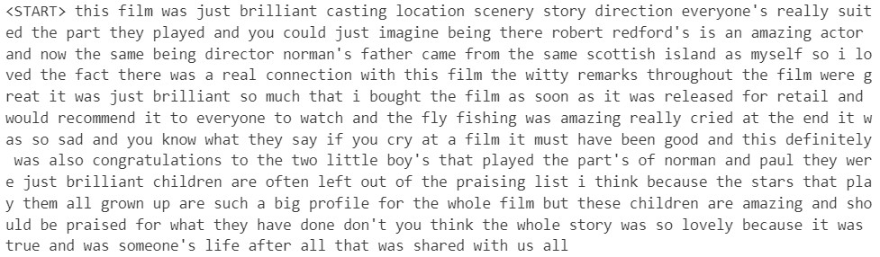
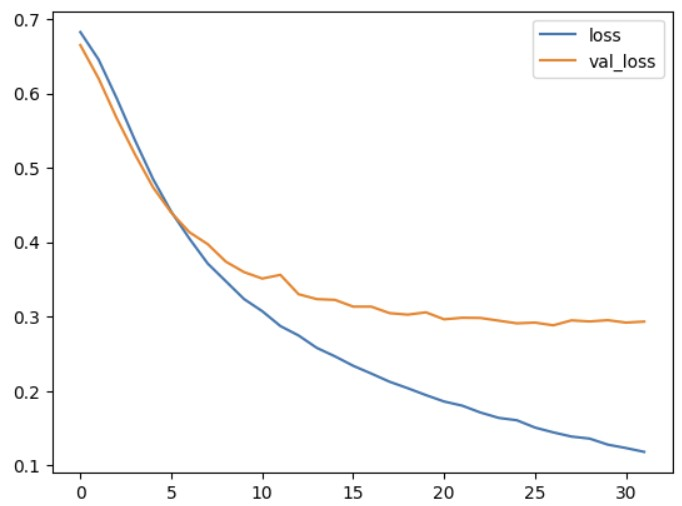
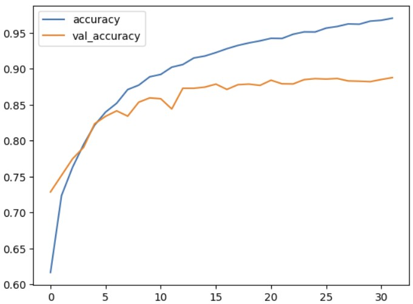
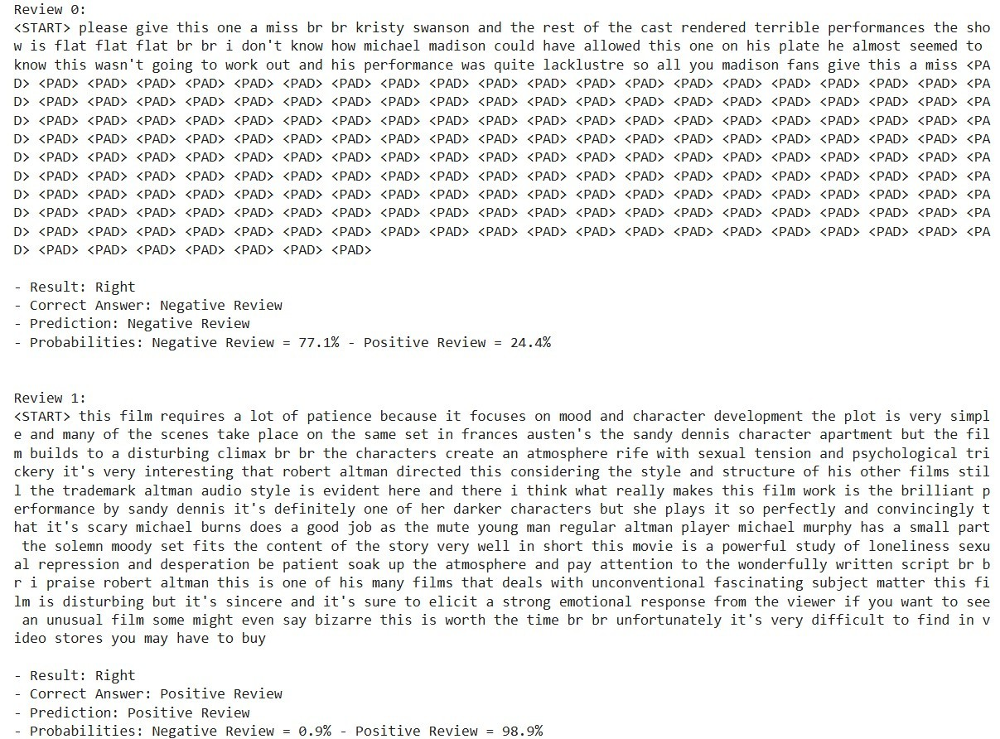
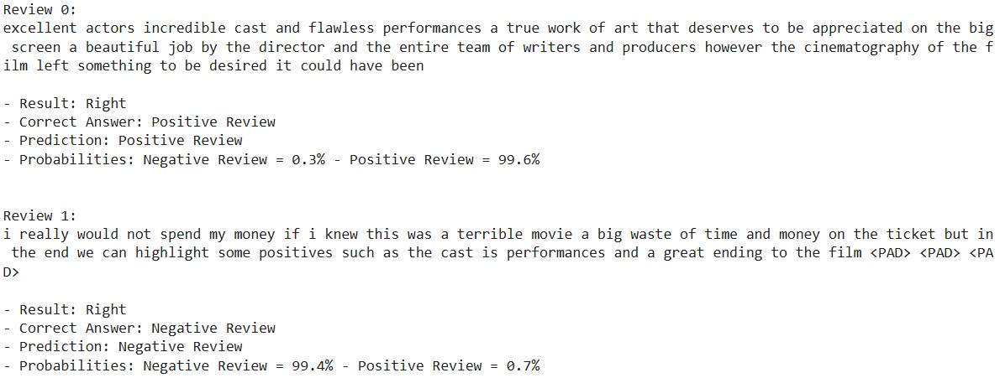

# Ciência de Dados - Projeto Final 8

## Projeto
**Modelo de deep learning** com processamento de linguagem natural (NLP) para análise de sentimentos em avaliações em uma plataforma de filmes e séries.

## Descrição
Nesse projeto de Ciência de Dados, foi realizada uma análise exploratória a fim de entender a forma como os reviews de filmes e séries foram armazenados para serem classificados em positivos ou negativos e se sua distribuição entre as classes está balanceada. Após isso, foram criados alguns modelos de Deep Learning usando o TensorFlow e o Keras, para que pudesse classificar corretamente os reviews dos usuários. Na criação desses modelos foram utilizadas técnicas de pré processamento, embedding, Redes Neurais Recorrentes (RNN) e ajustes para evitar overfitting, usando métricas como loss e accuracy. Após o treinamento de modelos com diferentes características, o modelo com a melhor performance obteve uma acurácia de 86% dos reviews classificados. Dessa forma, esse modelo permite sua aplicação em plataformas de filmes e séries, para classificar corretamente as avaliações dos usuários e assim oferecer melhores recomendações de conteúdos, aumentando o nível de engajamento e mantendo os usuários por mais tempo na plataforma, por exemplo.

## Overview de um review do dataset

## Verificações de overfitting no modelo

## Previsões do dataset realizadas pelo modelo

## Previsões de reviews manuais realizadas pelo modelo
